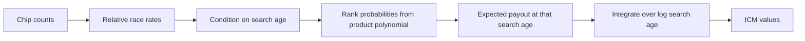

# Log-Age Quadrature ICM: A Deterministic ICM Method for Large Poker Tournament Fields

First draft, June 27, 2026.

## Abstract

Independent Chip Model calculations are easy to describe but hard to run exactly when the field is large. Exact recursive ICM methods work well for small final-table cases, but they become expensive as the number of remaining players and paid ranks grows. Monte Carlo methods avoid the full enumeration problem, but they introduce sampling noise.

Log-Age Quadrature ICM is a deterministic alternative. It maps each chip stack to a relative exponential-race rate, conditions on a search-age variable, computes rank probabilities with a product polynomial, and integrates expected payout over log search age with composite Gauss-Legendre quadrature. The result is a repeatable ICM estimate that can be run on real tournament-sized chip and payout lists.

This paper introduces the method, shows the core formula in code, compares it with exact Malmuth-Harville-style ICM on small fields, and compares it with Monte Carlo estimates on small and real WSOP-sized examples.

The source code, examples, and local calculator are available here:

https://github.com/curesive/log-age-quadrature-icm

## Why ICM Gets Expensive

Standard ICM starts from a simple idea: a player's chance to finish first is proportional to their share of chips. After one player is removed, the same idea is applied again to the remaining stacks to estimate second place, then third place, and so on.

For a small final table, this recursive calculation is practical. For a large field, it is not.

If there are `n` players remaining and `k` paid places to evaluate, exact recursive enumeration has to walk through a large number of possible ordered finish paths. That grows roughly like:

```text
n * (n - 1) * (n - 2) * ... for k ranks
```

A 9-player final table is still manageable. A 24-player all-paid example is already far larger. A 522-player field is not a practical target for direct enumeration.

Monte Carlo avoids this by simulating many random finish orders. That is useful, but it gives an estimate with a confidence interval. Running it twice can give slightly different answers unless the random seed is fixed.

Log-Age Quadrature ICM takes a different route. It keeps the exponential-race interpretation of ICM, but evaluates the probability calculation directly.

## Method Overview

The method can be explained in layers.



### 1. Stack To Rate

Each stack is converted into a relative race rate.

If player `i` has chip count `c_i`, total chips are `C`, and there are `n` players remaining, then the implementation uses:

```text
lambda_i = n * c_i / C
```

The scale is relative. A stack with twice as many chips gets twice the rate.

### 2. Search Age

Imagine that every player has an exponential race time. A player with a higher rate tends to have an earlier time, which corresponds to a better finish.

For a target player, condition on that player's race time, called search age here. At a fixed search age `y`, every other player has a probability of already being ahead:

```text
q_j(y) = 1 - exp(-lambda_j * y)
```

Big stacks have larger `lambda_j`, so they are more likely to be ahead at the same search age.

### 3. Rank Probabilities

At a fixed search age, the target player's rank depends on how many other players are ahead.

The algorithm builds a product polynomial:

```text
Product over j != i of ((1 - q_j) + q_j z)
```

The coefficient of `z^k` is the probability that exactly `k` other players are ahead of the target. If `k = 0`, the player is first. If `k = 1`, the player is second. If `k = 2`, the player is third.

This avoids listing every full finish order.

### 4. Payout Expectation

Once the rank probabilities are known, the expected payout at search age `y` is:

```text
expected_payout_i(y)
  = sum over rank r of P(player i finishes rank r at y) * payout_r
```

That is still conditional on one search age. The final ICM value averages this over all search ages.

### 5. Log-Age Quadrature

The search-age range is wide. Important behavior happens very close to zero and also far into the tail. The method changes variables:

```text
u = log(1 + y)
y = exp(u) - 1
```

Then it integrates over `u`, the log-age variable.

The implementation uses composite Gauss-Legendre quadrature. The default settings are:

- 192 log-age nodes
- 32 panels

The same inputs produce the same nodes, the same weights, and the same answer. There is no random sampling in the Log-Age Quadrature ICM calculation.

## Core Reference Code

The public repository contains two solver files:

- `src/log-age-quadrature-icm.js`: optimized implementation used by the calculator.
- `paper/log-age-quadrature-icm-snippet.js`: slower, clearer version intended for reading.

The central loop in the paper snippet looks like this:

```js
for (let targetIndex = 0; targetIndex < playerCount; targetIndex += 1) {
  for (let nodeIndex = 0; nodeIndex < quadrature.nodes.length; nodeIndex += 1) {
    const logAge = quadrature.nodes[nodeIndex];
    const searchAge = Math.expm1(logAge);
    const logNodeWeight = Math.log(quadrature.weights[nodeIndex]) + logAge;

    for (let playerIndex = 0; playerIndex < playerCount; playerIndex += 1) {
      aheadProbabilities[playerIndex] = aheadProbability(
        relativeRates[playerIndex],
        searchAge,
      );
    }

    const distribution = leaveOneOutRankDistribution(
      aheadProbabilities,
      targetIndex,
      rankLimit,
    );

    let conditionalPayout = 0;
    for (let rank = 0; rank < rankLimit; rank += 1) {
      conditionalPayout += distribution[rank] * payoutFractions[rank];
    }

    const centeredPayout = conditionalPayout - tailBase;
    const contributionLog =
      logNodeWeight +
      Math.log(relativeRates[targetIndex]) -
      (relativeRates[targetIndex] * searchAge);

    rawEquities[targetIndex] +=
      Math.exp(Math.max(-745, Math.min(709, contributionLog))) *
      centeredPayout;
  }
}
```

This is not the fastest possible version, but it shows the main idea directly:

1. choose a log-age quadrature node,
2. compute who is likely to be ahead at that age,
3. build the target player's rank distribution,
4. multiply by payouts,
5. add the quadrature-weighted contribution.

## Full-Field Versus Selected-Player Mode

The public calculator has two modes.

In selected-player mode, the solver computes only one requested player's value. This is useful for a hero stack or one stack being studied.

In full-field mode, it computes every remaining player's value. The optimized full-field implementation shares work across players at each quadrature node. It builds prefix polynomial states and then uses a reverse pass to recover each player's leave-one-out result.

The math is the same. The full-field mode is just organized to avoid doing repeated work.

## Normalization

The full-field solver normalizes the final raw equities so that they sum to the active prize pool.

This matters because ICM should distribute the remaining prize money among the remaining players. If the active remaining prize pool is `$1,000,000`, the sum of all player ICM values should be `$1,000,000`.

The implementation clamps raw equity fractions to `[0, 1]` and rescales them to sum to one. In the generated result file, the empirical examples report normalized equity sums at floating-point precision.

## Results

The tables in this section were generated locally by:

```sh
node research/generate-paper-results.mjs
```

The saved files are:

- `research/results/log_age_quadrature_icm_paper_results.json`
- `research/results/log_age_quadrature_icm_paper_tables.md`

### Small Exact Comparison

For small fields, I compared Log-Age Quadrature ICM with exact recursive Malmuth-Harville-style ICM. The table rounds dollar amounts to whole dollars.

| Scenario | Seat | Chips | Exact MH | Log-Age 192 | Difference |
| --- | --- | --- | --- | --- | --- |
| 4-player teaching example | 1 | 40,000 | $3,554 | $3,554 | +$0 |
| 4-player teaching example | 2 | 30,000 | $2,987 | $2,987 | +$0 |
| 4-player teaching example | 3 | 20,000 | $2,241 | $2,241 | +$0 |
| 4-player teaching example | 4 | 10,000 | $1,218 | $1,218 | +$0 |
| 9-player final table example | 1 | 1,500,000 | $132,037 | $132,037 | +$0 |
| 9-player final table example | 5 | 400,000 | $81,290 | $81,290 | +$0 |
| 9-player final table example | 9 | 100,000 | $47,928 | $47,928 | +$0 |

For these small examples, Log-Age Quadrature ICM matches the exact recursion to the displayed dollar. The raw generated results include full floating-point values.

### Quadrature Convergence On The 9-Player Example

The 9-player example was also run at several quadrature resolutions. The displayed dollar errors round to zero. The equity error column shows the scale of the remaining floating-point difference.

| Requested nodes | Actual nodes | Max abs error | Mean abs error | Max equity error |
| --- | --- | --- | --- | --- |
| 48 | 128 | $0 | $0 | 2.656e-13 |
| 96 | 128 | $0 | $0 | 2.656e-13 |
| 128 | 128 | $0 | $0 | 2.656e-13 |
| 192 | 192 | $0 | $0 | 1.828e-15 |
| 384 | 384 | $0 | $0 | 1.791e-15 |
| 768 | 768 | $0 | $0 | 1.455e-15 |

This does not prove every large input is exact. It does show that, on this final-table shape, the quadrature error is far below a cent at the tested settings.

### Monte Carlo Comparison

Monte Carlo estimates were generated with seeded exponential-race simulations. The table reports the Monte Carlo mean and a 95% confidence interval. A deterministic method should not be judged against only one Monte Carlo point estimate; the interval matters.

| Scenario | Seat | Trials | Log-Age | MC mean | 95% CI | Inside CI? |
| --- | --- | --- | --- | --- | --- | --- |
| 4-player teaching example | 1 | 200,000 | $3,554 | $3,553 | $3,544 to $3,563 | yes |
| 4-player teaching example | 4 | 200,000 | $1,218 | $1,224 | $1,215 to $1,232 | yes |
| 9-player final table example | 1 | 200,000 | $132,037 | $132,041 | $131,854 to $132,229 | yes |
| 9-player final table example | 5 | 200,000 | $81,290 | $81,355 | $81,156 to $81,555 | yes |
| 9-player final table example | 9 | 200,000 | $47,928 | $47,947 | $47,809 to $48,086 | yes |
| WSOP 2025 Main Event Day 7 - 24 players | 1 | 1,000,000 | $3,073,949 | $3,075,330 | $3,069,595 to $3,081,066 | yes |
| WSOP 2025 Main Event Day 7 - 24 players | 12 | 1,000,000 | $1,547,794 | $1,547,574 | $1,543,351 to $1,551,798 | yes |
| WSOP 2025 Main Event Day 7 - 24 players | 24 | 1,000,000 | $678,213 | $676,661 | $674,353 to $678,969 | yes |
| WSOP 2024 Event 26 High Roller Day 1 - 99 players | 1 | 300,000 | $188,549 | $188,428 | $187,198 to $189,658 | yes |
| WSOP 2024 Event 26 High Roller Day 1 - 99 players | 50 | 300,000 | $66,885 | $66,918 | $66,198 to $67,637 | yes |
| WSOP 2024 Event 26 High Roller Day 1 - 99 players | 99 | 300,000 | $13,145 | $13,191 | $12,870 to $13,511 | yes |
| WSOP 2025 Main Event Snapshot - 522 players | 1 | 500,000 | $366,031 | $363,922 | $360,971 to $366,874 | yes |
| WSOP 2025 Main Event Snapshot - 522 players | 261 | 500,000 | $122,809 | $123,464 | $122,002 to $124,925 | yes |
| WSOP 2025 Main Event Snapshot - 522 players | 522 | 500,000 | $46,039 | $45,618 | $45,116 to $46,120 | yes |

In these runs, every Log-Age value falls inside the Monte Carlo 95% interval. The larger fields require more simulation trials, especially for short stacks and tail ranks. That is one practical advantage of deterministic quadrature: it does not need repeated random sampling to stabilize one player's value.

### Real Example Outputs

The repository includes three example datasets so readers can run the method without collecting their own data. These are not meant to cover every poker tournament shape. They are included to show how the method behaves on realistic inputs.

| Scenario | Seat | Chips | Log-Age ICM value | Equity |
| --- | --- | --- | --- | --- |
| WSOP 2025 Main Event Day 7 - 24 players | 1 / 24 | 63,600,000 | $3,073,949 | 8.091% |
| WSOP 2025 Main Event Day 7 - 24 players | 12 / 24 | 22,500,000 | $1,547,794 | 4.074% |
| WSOP 2025 Main Event Day 7 - 24 players | 24 / 24 | 5,400,000 | $678,213 | 1.785% |
| WSOP 2024 Event 26 High Roller Day 1 - 99 players | 1 / 99 | 1,211,000 | $188,549 | 2.523% |
| WSOP 2024 Event 26 High Roller Day 1 - 99 players | 50 / 99 | 344,000 | $66,885 | 0.895% |
| WSOP 2024 Event 26 High Roller Day 1 - 99 players | 99 / 99 | 61,000 | $13,145 | 0.176% |
| WSOP 2025 Main Event Snapshot - 522 players | 1 / 522 | 4,195,000 | $366,031 | 0.513% |
| WSOP 2025 Main Event Snapshot - 522 players | 261 / 522 | 925,000 | $122,809 | 0.172% |
| WSOP 2025 Main Event Snapshot - 522 players | 522 / 522 | 120,000 | $46,039 | 0.065% |

## What The Results Show

The small-field tests show that Log-Age Quadrature ICM agrees with exact recursive ICM on cases where exact recursion is practical. The convergence check shows that the quadrature settings are more than enough for the tested 9-player final-table shape.

The Monte Carlo comparison shows the same values from another angle. Monte Carlo produces intervals, not exact answers. In the tested examples, the deterministic Log-Age values sit inside the Monte Carlo intervals.

The real examples show the method running on field sizes that would be awkward or impractical for direct recursive enumeration.

## What This Method Is Not

Log-Age Quadrature ICM is not Monte Carlo. It does not simulate thousands or millions of tournaments to average the result.

It is also not presented here as a brute-force exact enumerator for every possible field size. It is a deterministic quadrature method based on the exponential-race view of ICM.

The practical claim is narrower and more useful:

Log-Age Quadrature ICM gives repeatable ICM values for real tournament chip and payout lists, while matching exact small-field calculations and agreeing with Monte Carlo confidence intervals in the examples tested here.

## Reproducibility

The public repository contains:

- the reference solver,
- the readable paper snippet,
- the browser calculator,
- the example datasets,
- the tests used for golden values,
- and the MIT License.

Repository:

https://github.com/curesive/log-age-quadrature-icm

Local commands:

```sh
npm test
npm start
```

Paper result generation:

```sh
node research/generate-paper-results.mjs
```

The main generated artifact is:

```text
research/results/log_age_quadrature_icm_paper_results.json
```

## Conclusion

Log-Age Quadrature ICM is a deterministic way to compute tournament equity from chip counts and payouts. It keeps the familiar ICM structure but avoids direct finish-order enumeration by conditioning on search age and integrating over log search age.

For small fields, it matches exact recursive ICM in the examples tested. For larger real examples, it produces values that agree with seeded Monte Carlo confidence intervals while avoiding Monte Carlo sampling noise.

The result is a practical method for explaining, testing, and running ICM calculations on real tournament data.
