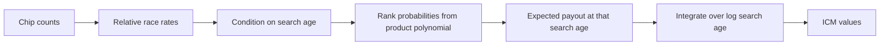

# Log-Age Quadrature ICM: A Deterministic ICM Method for Large Poker Tournament Fields

First draft, June 27, 2026.

## Abstract

Independent Chip Model calculations are easy to describe but hard to run exactly when the field is large. Exact recursive ICM methods work well for small final-table cases, but they become expensive as the number of remaining players and paid ranks grows. Monte Carlo methods avoid the full enumeration problem, but they introduce sampling noise.

Log-Age Quadrature ICM is a deterministic alternative. It maps each chip stack to a relative exponential-race rate, conditions on a search-age variable, computes rank probabilities with a product polynomial, and integrates expected payout over log search age with composite Gauss-Legendre quadrature. The result is a repeatable ICM estimate that can be run on real tournament-sized chip and payout lists.

This paper introduces the method, shows the core formula in code, compares it with exact Malmuth-Harville-style ICM on small fields, and compares it with Monte Carlo estimates on small and real WSOP-sized examples.

The source code, examples, and local calculator are available here:

https://github.com/curesive/log-age-quadrature-icm

## Why ICM Gets Expensive

Standard ICM starts from a simple idea: a player's chance to finish first is proportional to their share of chips. After one player is removed, the same idea is applied again to the remaining stacks to estimate second place, then third place, and so on.

For a small final table, this recursive calculation is practical. For a large field, it is not.

If there are `n` players remaining and `k` paid places to evaluate, exact recursive enumeration has to walk through a large number of possible ordered finish paths. That grows roughly like:

```text
n * (n - 1) * (n - 2) * ... for k ranks
```

A 9-player final table is still manageable. A 24-player all-paid example is already far larger. A 522-player field is not a practical target for direct enumeration.

Monte Carlo avoids this by simulating many random finish orders. That is useful, but it gives an estimate with a confidence interval. Running it twice can give slightly different answers unless the random seed is fixed.

Log-Age Quadrature ICM takes a different route. It keeps the exponential-race interpretation of ICM, but evaluates the probability calculation directly.

The connection between storage-and-search models and large-field ICM was brought to the author's attention by a GTO Wizard article describing a proprietary large-field ICM method and a Burville-Kingman special case used for exact benchmarking [1, 2]. GTO Wizard did not publish the underlying algorithm, so this paper does not claim that its method and Log-Age Quadrature ICM are mathematically identical. The formulation, implementation, and validation presented here were developed from the public storage-and-search paper and the standard ICM model, without access to GTO Wizard's proprietary method.

## Method Overview

The method can be explained in layers.


```mermaid
flowchart LR
  A["Chip counts"] --> B["Relative race rates"]
  B --> C["Condition on search age"]
  C --> D["Rank probabilities from product polynomial"]
  D --> E["Expected payout at that search age"]
  E --> F["Integrate over log search age"]
  F --> G["ICM values"]
```

### 1. Stack To Rate

Each stack is converted into a relative race rate.

If player `i` has chip count `c_i`, total chips are `C`, and there are `n` players remaining, then the implementation uses:

```text
lambda_i = n * c_i / C
```

The scale is relative. A stack with twice as many chips gets twice the rate.

### 2. Search Age

Imagine that every player has an exponential race time. A player with a higher rate tends to have an earlier time, which corresponds to a better finish.

For a target player, condition on that player's race time, called search age here. At a fixed search age `y`, every other player has a probability of already being ahead:

```text
q_j(y) = 1 - exp(-lambda_j * y)
```

Big stacks have larger `lambda_j`, so they are more likely to be ahead at the same search age.

### 3. Rank Probabilities

At a fixed search age, the target player's rank depends on how many other players are ahead.

The algorithm builds a product polynomial:

```text
Product over j != i of ((1 - q_j) + q_j z)
```

The coefficient of `z^k` is the probability that exactly `k` other players are ahead of the target. If `k = 0`, the player is first. If `k = 1`, the player is second. If `k = 2`, the player is third.

This avoids listing every full finish order.

### 4. Payout Expectation

Once the rank probabilities are known, the expected payout at search age `y` is:

```text
expected_payout_i(y)
  = sum over rank r of P(player i finishes rank r at y) * payout_r
```

That is still conditional on one search age. The final ICM value averages this over all search ages.

### 5. Log-Age Quadrature

The search-age range is wide. Important behavior happens very close to zero and also far into the tail. The method changes variables:

```text
u = log(1 + y)
y = exp(u) - 1
```

Then it integrates over `u`, the log-age variable.

The implementation uses composite Gauss-Legendre quadrature [5]. The default settings are:

- 192 log-age nodes
- 32 panels

The same inputs produce the same nodes, the same weights, and the same answer. There is no random sampling in the Log-Age Quadrature ICM calculation.

## Core Reference Code

The public repository contains two solver files:

- `src/log-age-quadrature-icm.js`: optimized implementation used by the calculator.
- `paper/log-age-quadrature-icm-snippet.js`: slower, clearer version intended for reading.

The central loop in the paper snippet looks like this:

```js
for (let targetIndex = 0; targetIndex < playerCount; targetIndex += 1) {
  for (let nodeIndex = 0; nodeIndex < quadrature.nodes.length; nodeIndex += 1) {
    const logAge = quadrature.nodes[nodeIndex];
    const searchAge = Math.expm1(logAge);
    const logNodeWeight = Math.log(quadrature.weights[nodeIndex]) + logAge;

    for (let playerIndex = 0; playerIndex < playerCount; playerIndex += 1) {
      aheadProbabilities[playerIndex] = aheadProbability(
        relativeRates[playerIndex],
        searchAge,
      );
    }

    const distribution = leaveOneOutRankDistribution(
      aheadProbabilities,
      targetIndex,
      rankLimit,
    );

    let conditionalPayout = 0;
    for (let rank = 0; rank < rankLimit; rank += 1) {
      conditionalPayout += distribution[rank] * payoutFractions[rank];
    }

    const centeredPayout = conditionalPayout - tailBase;
    const contributionLog =
      logNodeWeight +
      Math.log(relativeRates[targetIndex]) -
      (relativeRates[targetIndex] * searchAge);

    rawEquities[targetIndex] +=
      Math.exp(Math.max(-745, Math.min(709, contributionLog))) *
      centeredPayout;
  }
}
```

This is not the fastest possible version, but it shows the main idea directly:

1. choose a log-age quadrature node,
2. compute who is likely to be ahead at that age,
3. build the target player's rank distribution,
4. multiply by payouts,
5. add the quadrature-weighted contribution.

## Full-Field Versus Selected-Player Mode

The public calculator has two modes.

In selected-player mode, the solver computes only one requested player's value. This is useful for a hero stack or one stack being studied.

In full-field mode, it computes every remaining player's value. The optimized full-field implementation shares work across players at each quadrature node. It builds prefix polynomial states and then uses a reverse pass to recover each player's leave-one-out result.

The math is the same. The full-field mode is just organized to avoid doing repeated work.

## Normalization

The full-field solver normalizes the final raw equities so that they sum to the active prize pool.

This matters because ICM should distribute the remaining prize money among the remaining players. If the active remaining prize pool is `$1,000,000`, the sum of all player ICM values should be `$1,000,000`.

The implementation clamps raw equity fractions to `[0, 1]` and rescales them to sum to one. In the generated result file, the empirical examples report normalized equity sums at floating-point precision.

## Results

The tables in this section were generated locally by:

```sh
npm run research:validate
npm run research:validate-nine-player-mc
npm run research:stress-main-event
```

The saved files are:

- `research/results/core_validation_results.json`
- `research/results/core_validation_tables.md`
- `research/results/nine_player_monte_carlo_1m.json`
- `research/results/main_event_stress_4000.json`

The current validation set contains only the four studies selected for the paper:

1. Nine-player LAQI accuracy against exact Malmuth-Harville recursion.
2. Nine-player accuracy and runtime for exact recursion, LAQI, and 1-million-trial serial Monte Carlo.
3. A 522-player LAQI and 3-million-trial serial Monte Carlo comparison.
4. A 4,000-player LAQI stress test using generated stacks and the observed 2026 WSOP Main Event payout table.

The concise, current tables are in `research/results/core_validation_tables.md`. Complete numeric output is retained in the JSON files listed above so displayed values can be checked without relying on rounded paper tables.

## What The Results Show

The small-field test shows that Log-Age Quadrature ICM agrees with exact recursive ICM on a case where exact recursion is practical. The 522-player comparison also checks the production 192-node result against a 1,536-node LAQI reference.

The Monte Carlo comparison shows the same values from another angle. Monte Carlo produces intervals, not exact answers. In the tested examples, the deterministic Log-Age values sit inside the Monte Carlo intervals.

The 4,000-player stress test shows the method running at a scale that would be impractical for direct recursive enumeration.

## What This Method Is Not

Log-Age Quadrature ICM is not Monte Carlo. It does not simulate thousands or millions of tournaments to average the result.

It is also not presented here as a brute-force exact enumerator for every possible field size. It is a deterministic quadrature method based on the exponential-race view of ICM.

ICM itself is a model of tournament finishing probabilities, not an exact model of the underlying poker elimination process; Diaconis and Ethier discuss this distinction in detail [6].

The practical claim is narrower and more useful:

Log-Age Quadrature ICM gives repeatable ICM values for real tournament chip and payout lists, while matching exact small-field calculations and agreeing with Monte Carlo confidence intervals in the examples tested here.

## Reproducibility

The public repository contains:

- the reference solver,
- the readable paper snippet,
- the browser calculator,
- the example datasets,
- the tests used for golden values,
- and the MIT License.

Repository:

https://github.com/curesive/log-age-quadrature-icm

Local commands:

```sh
npm test
npm start
```

Paper result generation:

```sh
npm run research:validate
```

The main generated artifact is:

```text
research/results/core_validation_results.json
```

## Conclusion

Log-Age Quadrature ICM is a deterministic way to compute tournament equity from chip counts and payouts. It keeps the familiar ICM structure but avoids direct finish-order enumeration by conditioning on search age and integrating over log search age.

For small fields, it matches exact recursive ICM in the examples tested. For larger real examples, it produces values that agree with seeded Monte Carlo confidence intervals while avoiding Monte Carlo sampling noise.

The result is a practical method for explaining, testing, and running ICM calculations on real tournament data.

## References

1. Burville, P. J., and J. F. C. Kingman. "On a Model for Storage and Search." *Journal of Applied Probability* 10, no. 3 (1973): 697-701. https://doi.org/10.2307/3212792

2. Tombos21. "Theoretical Breakthroughs in ICM." *GTO Wizard Blog*, July 29, 2024. https://blog.gtowizard.com/theoretical-breakthroughs-in-icm/. Accessed July 26, 2026.

3. Harville, David A. "Assigning Probabilities to the Outcomes of Multi-Entry Competitions." *Journal of the American Statistical Association* 68, no. 342 (1973): 312-316. https://doi.org/10.1080/01621459.1973.10482425

4. Malmuth, Mason. *Gambling Theory and Other Topics*. Henderson, Nevada: Two Plus Two Publishing, 1987.

5. Golub, Gene H., and John H. Welsch. "Calculation of Gauss Quadrature Rules." *Mathematics of Computation* 23, no. 106 (1969): 221-230. https://doi.org/10.1090/S0025-5718-69-99647-1

6. Diaconis, Persi, and Stewart N. Ethier. "Gambler's Ruin and the ICM." *Statistical Science* 37, no. 3 (2022): 289-305. https://doi.org/10.1214/21-STS826

7. PokerNews. "2024 WSOP Event #26: $25,000 High Roller No-Limit Hold'em (8-Handed)." Chip counts and payouts. https://www.pokernews.com/tours/wsop/2024-wsop/event-26-25000-high-roller/. Accessed April-May 2026.

8. PokerNews. "2025 WSOP Event #81: $10,000 WSOP Main Event World Championship." Chip counts and payouts. https://www.pokernews.com/tours/wsop/2025-wsop/event-81-10000-wsop-main-event/. Accessed May 2026.
